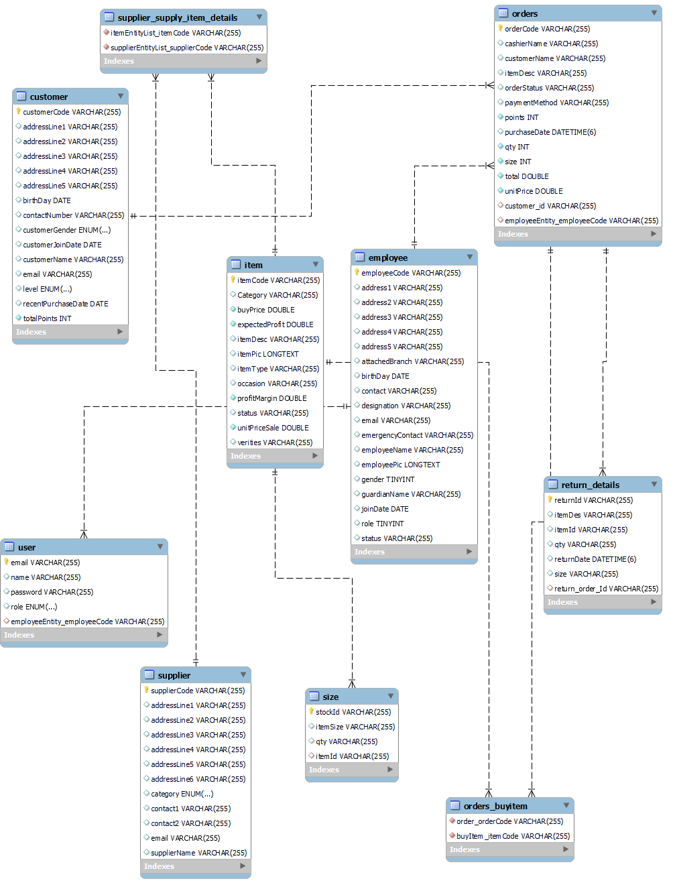

# Shoe Shop Management System - Back End

## Overview

The Shoe Shop Management System is a comprehensive solution designed to streamline the operations of a shoe retail business. This system handles various aspects such as inventory management, sales tracking, customer management, enabling shoe shop owners to efficiently manage their store.

## Features

- **Inventory Management:** Track stock levels,manage suppliers, manage items and manage customers.
- **Sales Tracking:** Record sales transactions and manage returns.
- **Customer Management:** Maintain a database of customers, track purchase history, and manage loyalty programs.
- **User Management:** Administer user roles and permissions to control access to different parts of the system.

## ER Diagram



## Technologies Used

- **Frontend:** HTML, CSS, JavaScript
- **Backend:** Spring Boot
- **Database:** MySQL
- **Authentication:** JWT (JSON Web Tokens)

## Installation

To get a local copy up and running, follow these simple steps:

### Prerequisites

- Java Development Kit (JDK) installed on your machine
- Maven installed on your machine
- MySQL installed on your machine or a MySQL database service

### Installation Steps

1. **Clone the repository:**
    ```sh
    git clone https://github.com/Dilshan-Dekumpitiya/Shoe-Shop-Management-Back-End.git
    ```
2. **Navigate to the project directory:**
    ```sh
    cd shoe-shop-management-system
    ```
3. **Set up environment variables:**
   Create an `application.properties` file in the `src/main/resources` directory and add your database configuration and any other necessary environment variables:
    ```
    spring.datasource.url=jdbc:mysql://localhost:3306/shoe_shop
    spring.datasource.username=your_mysql_username
    spring.datasource.password=your_mysql_password
    spring.jpa.hibernate.ddl-auto=update
    jwt.secret=your_jwt_secret
    ```
4. **Install the dependencies:**
    ```sh
    mvn install
    ```
5. **Run the application:**
    ```sh
    mvn spring-boot:run
    ```